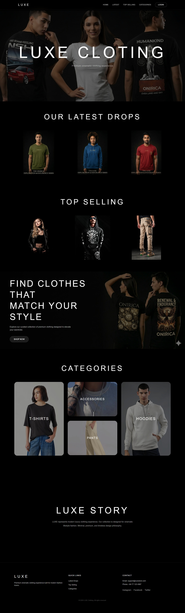
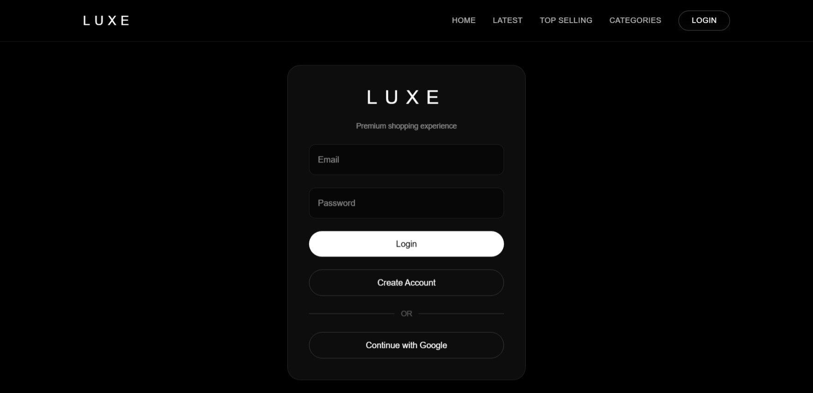
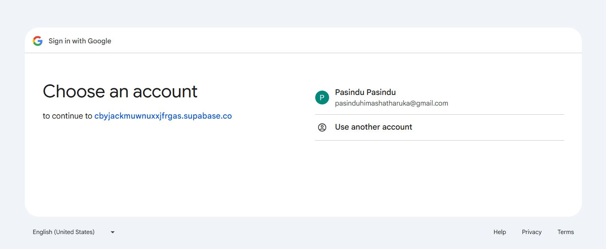
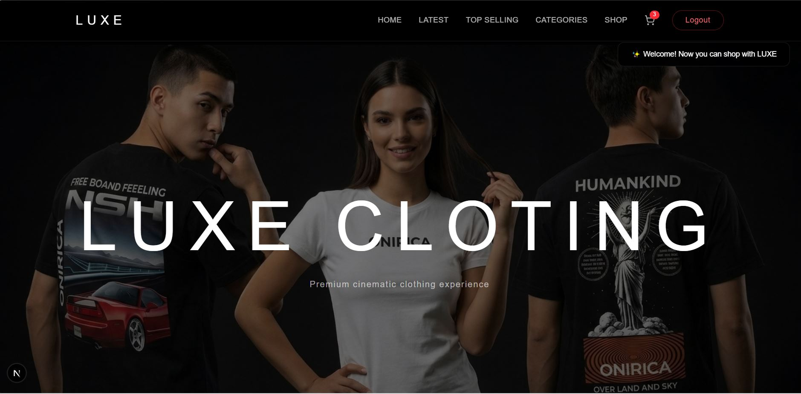
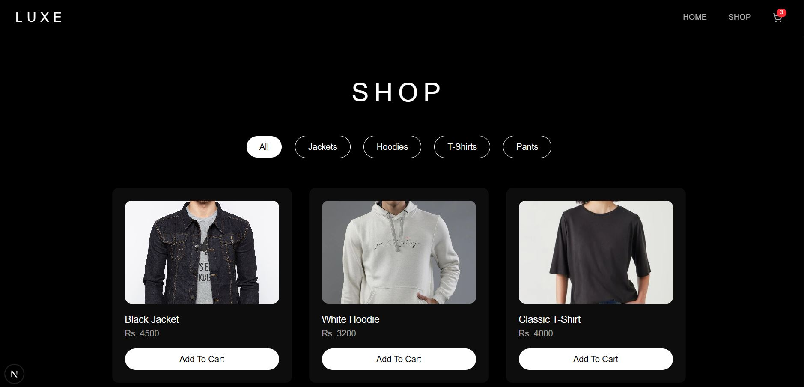
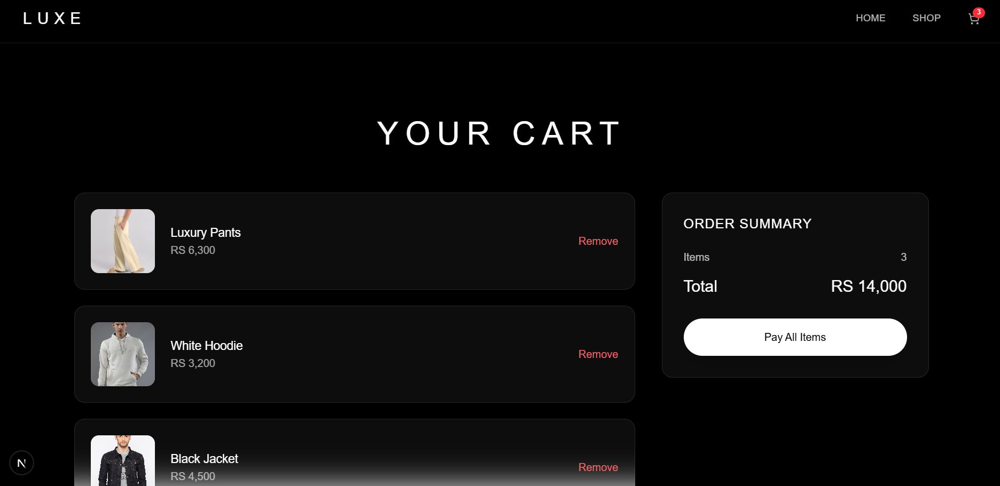
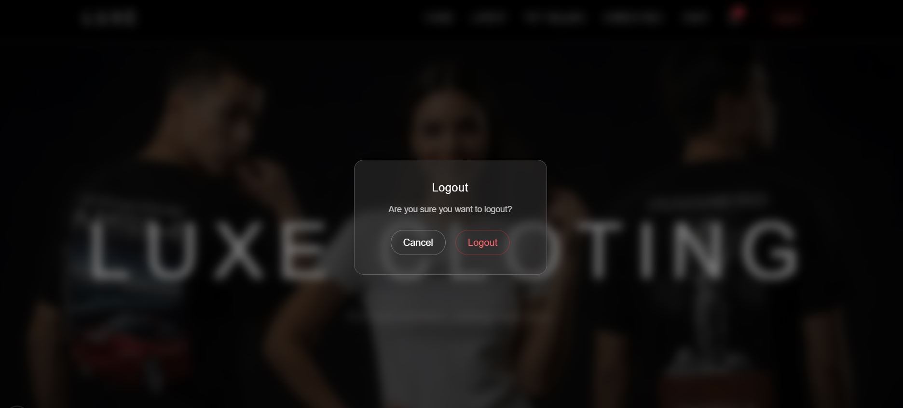
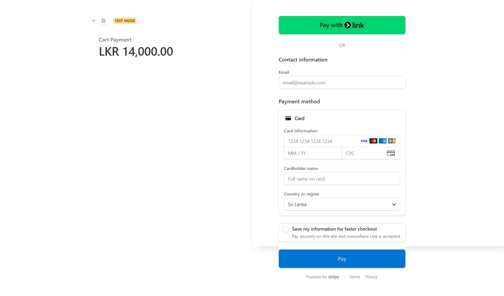
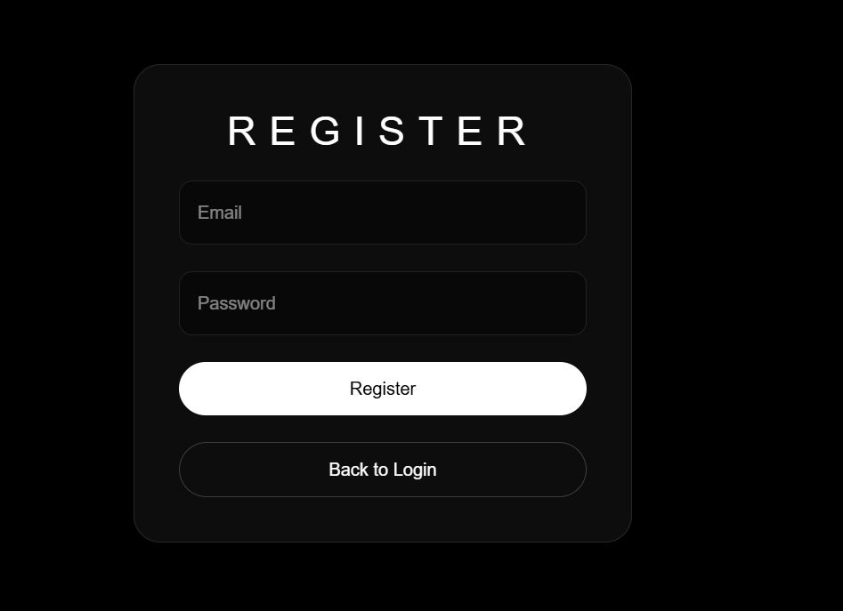

# LUXE Clothing Website 

LUXE is a **modern luxury clothing e-commerce website** built as a **portfolio project** to demonstrate full-stack web development skills.  
It combines **Next.js**, **Supabase**, **Tailwind CSS**, and **Framer Motion** to create a **premium, cinematic shopping experience**.

---

##  Features

- Modern luxury **UI / UX** design
- **User authentication** with Supabase (login / logout / register)
- **Google login integration**
- **Shopping cart** with add/remove functionality
- Responsive **product categories** section
- Animated **hero and story sections** with Framer Motion
- Preview of **latest drops** and **top selling products**

---

##  Tech Stack

- **Next.js** – Frontend and routing
- **Tailwind CSS** – Styling
- **Supabase** – Authentication & database
- **Framer Motion** – Animations
- **Vercel** – Deployment

---

##  Live Demo
[View LUXE Clothing Live Website](https://luxe-clothing-store-iota.vercel.app/)

##  Screenshots

### Homepage (Before Login)


### Login Page


### Google Login


### Navbar After Login


### Shopping Page


### Cart Page


### Logout


### Stripe Payment Preview


### Register Page


---

##  Project Structure


luxe-clothing/
│
├─ app/ # Next.js pages
├─ components/ # Reusable components (Navbar, Hero, StorySection)
├─ lib/ # Supabase client & helpers
├─ public/ # Images and static assets
├─ package.json
├─ next.config.js
└─ README.md


---

##  How to Run Locally

1. Clone the repository:

```bash
git clone https://github.com/YOURUSERNAME/luxe-clothing-store.git
cd luxe-clothing-store

Install dependencies:

npm install

Add environment variables (create .env.local):

NEXT_PUBLIC_SUPABASE_URL=your_supabase_url
NEXT_PUBLIC_SUPABASE_ANON_KEY=your_supabase_anon_key

Run the development server:

npm run dev

Open http://localhost:3000
 to view in browser.


 Author

Student Project – Clothing Website
